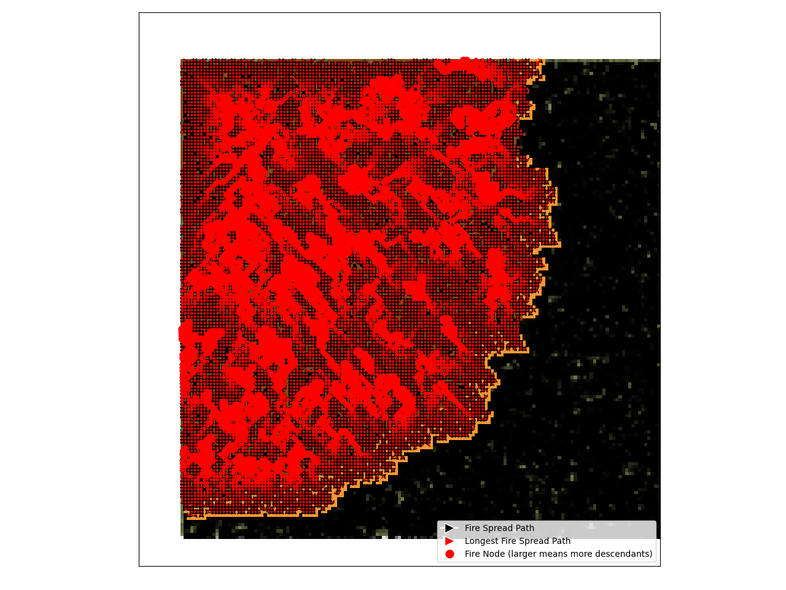

# EmberMind

<p align="center">
  
</p>

EmberMind is my dissertation project on wildfire spread simulation, fast mitigation strategy search, and reinforcement-learning-based response planning.

## Overview

EmberMind was developed in response to the growing number of wildfires happening around the world. I wanted this project to be both a serious research effort and a thoughtful open-source contribution, while also exploring how simulation and intelligent systems might support faster, better wildfire mitigation.

This repository builds on the SimFire ecosystem, so thanks to the SimFire authors and maintainers for creating the library that made this work possible.

The repository is built around two closely related codebases stored under `FYP_old/`:

- `simfire`: the wildfire simulator itself
- `simharness`: a reinforcement learning harness that wraps the simulator so agents can act inside it

In practice, this repository contains:

- a physics-inspired wildfire simulator
- a reactive multi-agent environment for experimentation
- reinforcement learning configuration and environment code
- Optuna-based search code for trying mitigation strategies
- saved outputs such as `.npy` simulation data, graphs, and experiment databases

## What The Project Is About

The core goal is to treat wildfire mitigation as a sequential decision-making problem. Instead of viewing wildfire as a static event, the project models it as a changing environment where:

- a fire spreads over time across terrain
- wind, slope, and fuel properties affect how quickly and where it spreads
- one or more agents move across the map
- agents place mitigation lines to reduce the final burned area

This makes the project suitable for:

- simulation-based optimisation
- reinforcement learning

## Theory Behind The Project

### 1. Wildfire Spread Modelling

The simulator uses surface fire spread modelling, including a Rothermel-style rate-of-spread implementation in [FYP_old/simfire/simfire/world/rothermel.py](/Users/denizzg/Documents/projects/FYP_Yr3/FYP_old/simfire/simfire/world/rothermel.py:1). The idea is to model how fire behaviour changes as terrain and environmental conditions change.

Spread rate depends on:

- fuel load and fuel-bed depth
- moisture content and moisture of extinction
- mineral content and particle density
- wind speed and direction
- terrain slope and slope direction

### 2. Grid-Based Environment Representation

The landscape is represented as 2D arrays such as:

- `fire_map`
- `elevation`
- `w_0`
- `sigma`
- `delta`
- `M_x`
- wind magnitude and direction

### 3. Reinforcement Learning Formulation

Inside the harness, mitigation is framed as an RL problem, where agents learn by interacting with the simulated fire environment:

- state: stacked map layers and simulation variables
- action: movement plus mitigation interaction
- transition: fire and agent positions update after each step
- reward: reward functions compare damage against a benchmark fire and favour reduced spread / saved area

Key environment code:

- [FYP_old/simharness/simharness2/environments/multi_agent_fire_harness.py](/Users/denizzg/Documents/projects/FYP_Yr3/FYP_old/simharness/simharness2/environments/multi_agent_fire_harness.py:1)
- [FYP_old/simharness/simharness2/environments/reactive_marl.py](/Users/denizzg/Documents/projects/FYP_Yr3/FYP_old/simharness/simharness2/environments/reactive_marl.py:1)

The reward logic compares active runs against benchmark fire behaviour, for example in [FYP_old/simharness/simharness2/rewards/area_saved_reward.py](/Users/denizzg/Documents/projects/FYP_Yr3/FYP_old/simharness/simharness2/rewards/area_saved_reward.py:1), so the model is encouraged to reduce damage rather than simply act at random.

### 4. Strategy Search

The repository also contains Optuna-based optimisation experiments in [FYP_old/simfire/sim.py](/Users/denizzg/Documents/projects/FYP_Yr3/FYP_old/simfire/sim.py:1), which are useful for testing mitigation strategies outside the full RL workflow.

## Repository Structure

```text
FYP_Yr3/
├── FYP_old/
│   ├── simfire/       # Wildfire simulation package
│   ├── simharness/    # RL / multi-agent harness around simfire
│   ├── data/          # Saved simulation arrays and metadata
│   └── graphs/        # Generated fire spread graphs
├── README.md
└── pyproject.toml
```

## Dependencies

### Python Version

- Python `>=3.9,<3.10`

### Main Python Dependencies

Main dependencies:

- `simfire` as a local package
- `simharness2` as a local package
- `ray[rllib,tune]`
- `gymnasium`
- `torch`
- `hydra-core`
- `aim`
- `optuna`
- `numpy`
- `matplotlib`
- `pygame`
- `opencv-python`
- `geopandas`
- `landfire`

### System Dependencies

You may also need system packages for:

- graphics and windowing support for `pygame`
- image and video processing
- geospatial libraries used by `geopandas`
- build tools such as `build-essential`
- `swig` for some builds

On Ubuntu-like systems, `build-essential`, `libgl1`, and `swig` are a good starting point.

## Installation

### 1. Install Python 3.9

Using `pyenv` is the safest option:

```bash
pyenv install 3.9.18
pyenv local 3.9.18
```

### 2. Install Poetry

```bash
curl -sSL https://install.python-poetry.org | python3 -
```

Then from the repository root run:

```bash
poetry env use 3.9
poetry install
```

## How To Run The Project

There are two main entry points, depending on whether you want to run simulation search experiments or interact with the reactive environment.

### Option 1: Run The Wildfire Simulation / Search Script

From the repository root:

```bash
poetry run python FYP_old/simfire/sim.py
```

This runs the simulator and Optuna search workflow.

### Option 2: Run The Reactive Multi-Agent Environment

From the repository root:

```bash
poetry run python FYP_old/simharness/main.py
```

This runs the current reactive multi-agent environment.

### Useful Hydra Overrides

The harness uses Hydra, so you can override values on the command line:

```bash
poetry run python FYP_old/simharness/main.py environment.env_config.num_agents=2
```

```bash
poetry run python FYP_old/simharness/main.py simulation.simulation.runtime=1hr
```

```bash
poetry run python FYP_old/simharness/main.py cli.data_dir=./outputs
```

The codebase still contains older RLlib train/tune/eval infrastructure, but the current top-level `main.py` behaves as a reactive environment runner.

## How To Use The Project Yourself

### For Simulation Research

Useful for:

- study how wind, terrain, and fuel affect spread
- test different initial fire positions
- compare mitigation placements
- inspect generated `fire_map` and metadata outputs

Useful files:

- [FYP_old/simfire/configs/operational_config.yml](/Users/denizzg/Documents/projects/FYP_Yr3/FYP_old/simfire/configs/operational_config.yml:1)
- [FYP_old/simharness/conf/simulation/simfire/default.yaml](/Users/denizzg/Documents/projects/FYP_Yr3/FYP_old/simharness/conf/simulation/simfire/default.yaml:1)

### For Reinforcement Learning Experiments

Useful for:

- change the number of agents
- change movement or interaction spaces
- swap reward functions
- alter observation attributes
- adapt the environment for RLlib experiments

Start here:

- [FYP_old/simharness/conf/marl_config.yaml](/Users/denizzg/Documents/projects/FYP_Yr3/FYP_old/simharness/conf/marl_config.yaml:1)
- [FYP_old/simharness/conf/environment/reactive_marl.yaml](/Users/denizzg/Documents/projects/FYP_Yr3/FYP_old/simharness/conf/environment/reactive_marl.yaml:1)
- [FYP_old/simharness/simharness2/rewards](/Users/denizzg/Documents/projects/FYP_Yr3/FYP_old/simharness/simharness2/rewards:1)

## Outputs And Data

The repository already includes outputs from previous runs:

- `FYP_old/data/` for saved simulation arrays and metadata
- `FYP_old/graphs/` for spread graphs
- `.db` Optuna study databases under `FYP_old/simfire/`

These are useful if you want to inspect previous experiments before running new ones.

## Notes

- Much of the repository is a working research archive rather than a polished library.
- `FYP_old/` is effectively the real project root for the simulator and harness code.
- Some documentation inside the embedded subprojects reflects earlier training workflows that are still useful for reference, but not all of it matches the current top-level runnable entrypoints exactly.
- As this is an open-source research project, feel free to reach out if you have questions about the repository or how the project is structured.

## License

This repository includes upstream MITRE Fireline components with their own license files inside `FYP_old/simfire/` and `FYP_old/simharness/`. See those directories for the original package-level licensing details.
